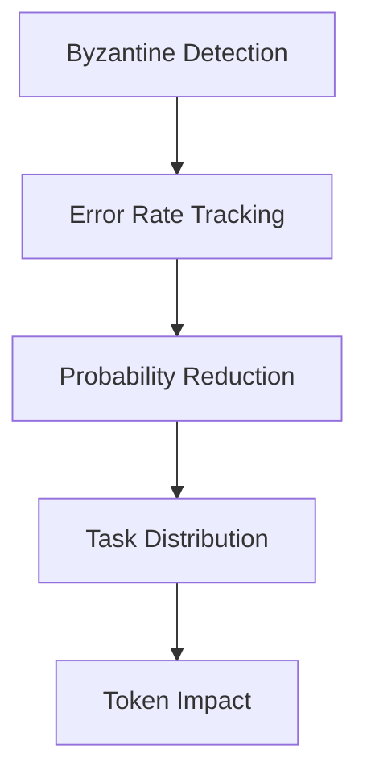
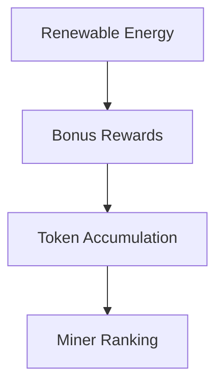
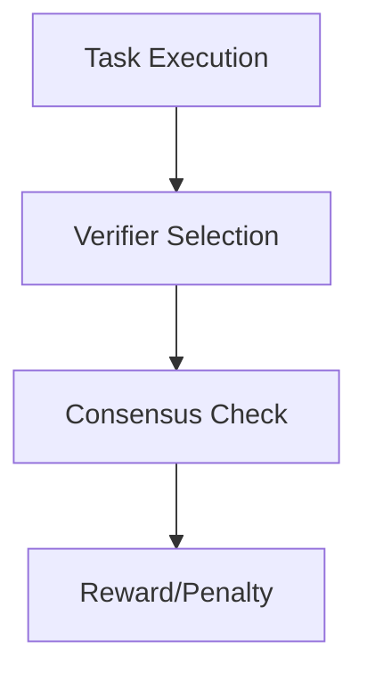

# Blockchain Mining Simulation Documentation

## Overview
This documentation explains the working, assumptions, and mathematical models behind the blockchain mining simulation. The simulation demonstrates Byzantine fault tolerance in a proof-of-work system with renewable energy considerations.

## Documentation Structure

### 1. [Architecture](architecture.md)
- System components and their interactions
- Data flow diagrams
- Component responsibilities
- Sequence diagrams of key processes

### 2. [Mathematical Models](formulas.md)
- Task cost calculations
- Reward and penalty formulas
- Byzantine detection mechanisms
- Probability calculations
- Performance metrics

### 3. [Assumptions & Considerations](assumptions.md)
- Core system assumptions
- Implementation considerations
- System limitations
- Future improvements
- Scalability factors

## Key Features Explained

### Byzantine Fault Tolerance


### Renewable Energy Integration


### Validation System


## System Metrics

### Performance Indicators
1. Task Success Rate
2. Byzantine Miner Detection
3. Token Distribution
4. Renewable Energy Impact

### Visualization Components
1. Miner Scores Over Time
2. Average Renewable Energy Usage
3. Task Success Rate
4. Final Token Distribution

## Implementation Details

### Core Components
1. BlockchainSimulation
2. TaskDistributor
3. ValidationManager
4. Miner
5. Visualizer

### Key Algorithms
1. Miner Selection
2. Task Distribution
3. Byzantine Detection
4. Reward Calculation

## Getting Started

### Running the Simulation
```bash
python main.py
```

### Understanding Output
1. Initial miner states
2. Task execution progress
3. Byzantine behavior warnings
4. Final statistics and analysis

### Interpreting Results
1. Token distribution patterns
2. Byzantine miner impact
3. System efficiency
4. Fairness metrics

## Additional Resources
- [Task Types and Complexity](formulas.md#1-task-cost-calculation)
- [Byzantine Detection Mechanism](formulas.md#6-byzantine-detection)
- [Reward System](formulas.md#3-reward-calculation)
- [System Limitations](assumptions.md#4-system-limitations) 