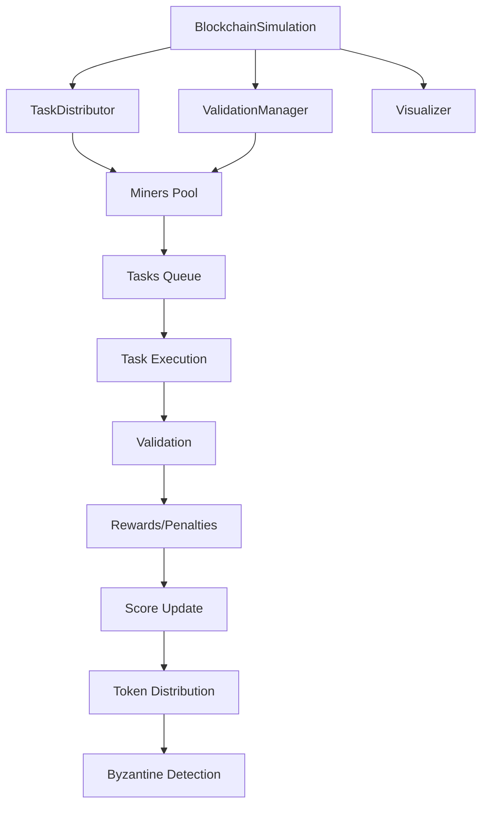
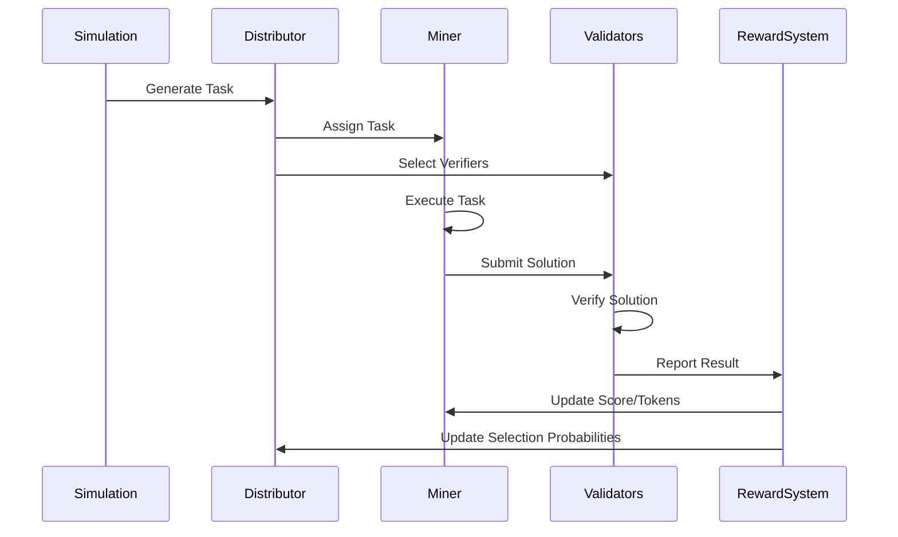

# Blockchain Mining Simulation Architecture

## System Components and Flow

## Component Responsibilities

1. **BlockchainSimulation**
   - Orchestrates the entire simulation
   - Manages task generation and distribution
   - Tracks overall system performance
   - Coordinates between all components

2. **TaskDistributor**
   - Maintains task queue
   - Selects miners based on their scores and Byzantine behavior
   - Assigns verifiers for each task
   - Uses probability-based selection mechanism

3. **ValidationManager**
   - Validates task solutions
   - Calculates rewards and penalties
   - Manages consensus mechanism
   - Handles token distribution

4. **Miners**
   - Execute assigned tasks
   - Verify other miners' solutions
   - Maintain individual performance metrics
   - Can be honest or Byzantine

5. **Visualizer**
   - Tracks system metrics over time
   - Generates performance visualizations
   - Monitors Byzantine behavior impact
   - Shows token distribution

## Data Flow

1. Task Generation → Distribution → Execution → Validation → Reward/Penalty → Score Update
2. Continuous monitoring of miner behavior and performance
3. Real-time visualization updates
4. Byzantine behavior detection and mitigation

## Key Interactions

