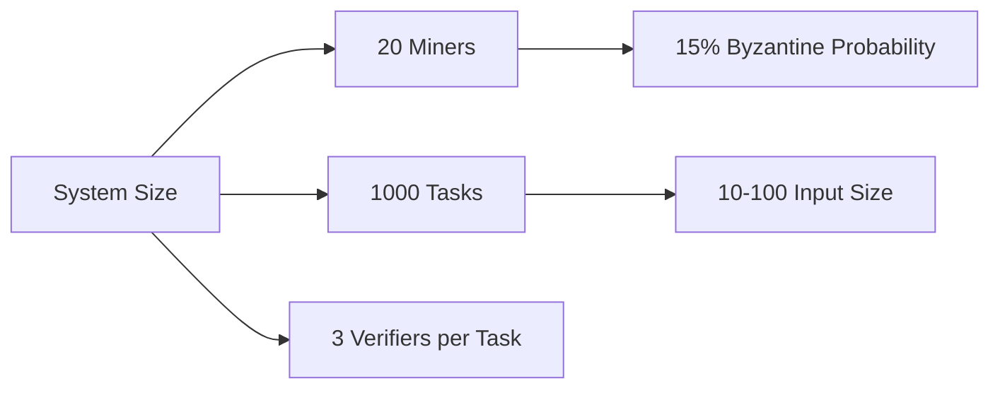
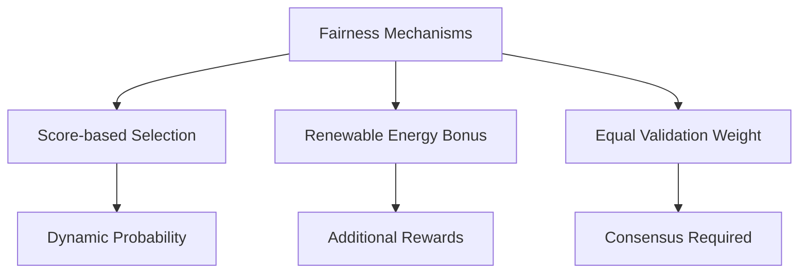
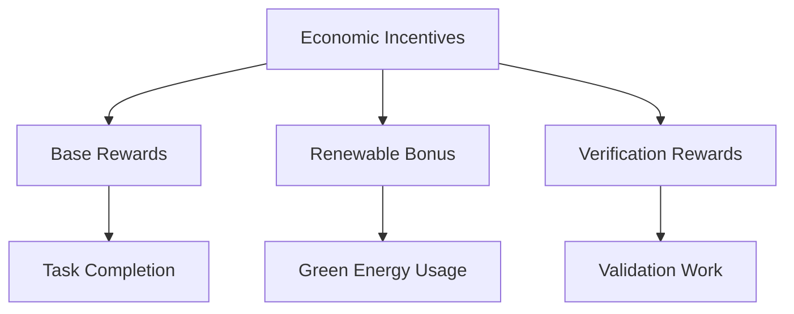
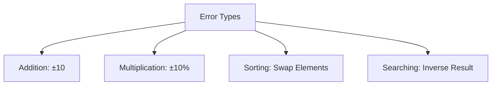
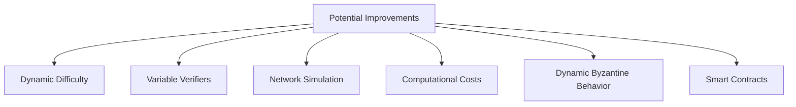

# Simulation Assumptions and Considerations

## Core Assumptions

### 1. Byzantine Behavior
- Only 1-3 miners can be Byzantine in the system
- Byzantine miners have a 30% probability of error per task execution
- Miners are classified as Byzantine when their error rate exceeds 20%
- Byzantine behavior is persistent throughout the simulation
- Byzantine miners cannot change their behavior dynamically

### 2. Task Execution
- All miners have equal computational capabilities
- Task execution time is not considered (instant execution)
- Task difficulty is solely based on input size
- All task types are equally likely to be generated

### 3. Validation
- Verifiers are always honest in validation
- Validation results are immediate
- Consensus requires majority agreement
- All verifiers have equal weight in validation

### 4. Renewable Energy
- Renewable energy proportion remains constant for each miner
- Higher renewable energy usage deserves additional rewards
- Renewable energy status cannot be falsified

### 5. Scoring System
- Scores can never go below zero
- Initial scores start at zero
- Score affects future task assignment probability
- Penalties are proportional to task cost

## System Considerations

### 1. Scalability

### 2. Fault Tolerance
- System can handle up to 3 Byzantine miners
- Majority consensus prevents Byzantine control
- Score reduction mechanism limits Byzantine impact
- Error detection through validation

### 3. Fairness

### 4. Performance Metrics
- Success rate as primary system health indicator
- Token distribution shows economic impact
- Error rates identify Byzantine behavior
- Task completion tracks participation

### 5. Economic Model

## Implementation Considerations

### 1. Task Types
- Addition: Linear complexity
- Multiplication: Linear complexity
- Sorting: N log N complexity
- Searching: Linear complexity

### 2. Error Introduction

### 3. Visualization
- Real-time metric updates
- Four key performance graphs
- Token distribution tracking
- Score evolution monitoring

### 4. System Limitations
- No dynamic difficulty adjustment
- Fixed number of verifiers
- No network latency simulation
- No computational cost consideration

### 5. Future Improvements
